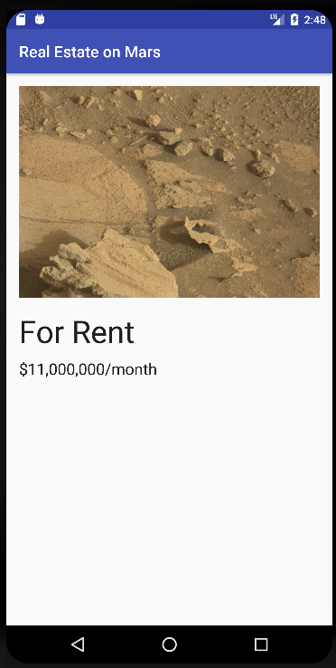

# Android-NASA-Real-Estate-Mars
Is Android app that uses Kotlin and [MVVM architecture](https://blog.mindorks.com/mvvm-architecture-android-tutorial-for-beginners-step-by-step-guide) is a simple app that uses Coroutines, LiveData with Retrofit, Glide, Moshi .
# Connect to the Internet - Mars Real Estate
### This is the toy app for Lesson 8 of the Android App Development in Kotlin course on Udacity.

This app demonstrates the following views and techniques:

- [Retrofit](https://square.github.io/retrofit/) to make api calls to an [HTTP web](https://mars.udacity.com/) service
- [Moshi](https://github.com/square/moshi) which handles the deserialization of the returned JSON to Kotlin data objects
- [Glide](https://bumptech.github.io/glide/) to load and cache images by URL.
- [Kotlin Coroutines](https://kotlinlang.org/docs/coroutines-overview.html) a software module specially organized to ensure interaction with other modules on the principle of cooperative multitasking.

It leverages the following components from the [Jetpack library](https://developer.android.com/jetpack):
- [ViewModel](https://developer.android.com/topic/libraries/architecture/viewmodel)
- [LiveData](https://square.github.io/retrofit/)
- [Data Binding](https://developer.android.com/topic/libraries/data-binding/) with binding adapters
- [Navigation](https://developer.android.com/guide/navigation)

# How does this work?

# Screenshots 

### Also, you can install app-debug.apk to check the app ###
 

